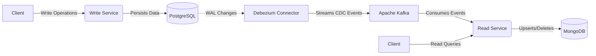

<div align="center">
  <h1>⚡ Real-Time Data Synchronization Pipeline</h1>
  <p>
    <strong>A high-performance Change Data Capture (CDC) architecture utilizing Debezium, Kafka, PostgreSQL, and MongoDB.</strong>
  </p>
  <p>
    
    
    
    
    
  </p>
</div>

<br />

## 📖 Overview

This project implements a robust event-driven microservices architecture inspired by **CQRS (Command Query Responsibility Segregation)**. It features a complete **Change Data Capture (CDC)** pipeline that synchronizes data in real-time from a primary normalized database (PostgreSQL) to a denormalized, read-optimized data store (MongoDB) without relying on dual-writes or batch jobs.

The system ensures strict decoupling, high availability, and **at-least-once message delivery** semantics with an idempotent Kafka consumer handling eventual consistency.

---

## 🏗️ Architecture



1. **Write Service**: Manages write operations (Create, Update, Soft-Delete) against the PostgreSQL database.
2. **Debezium**: Monitors the PostgreSQL WAL (Write-Ahead Log) for row-level changes and publishes them to Kafka.
3. **Kafka & Zookeeper**: Acts as the fault-tolerant event broker holding the stream of data mutations.
4. **Read Service**: Consumes the Kafka topic safely and idempotently, updating the MongoDB database to serve fast read requests.

---

## ⚙️ Features

- **Real-Time CDC**: Row-level database changes captured and streamed with minimal latency.
- **Idempotent Consumers**: Prevents data corruption and handles duplicate messages gracefully.
- **Tombstone Handling**: Correct processing of soft deletes (`deleted_at` timestamps) and hard deletes (Kafka tombstones).
- **Containerized Ecosystem**: Fully orchestrated with Docker Compose, including inter-service health checks.
- **Text Search & Filtering**: Fast read capabilities exposed via MongoDB endpoints.

---

## 🚀 Getting Started

### Prerequisites
- [Docker](https://www.docker.com/products/docker-desktop) and Docker Compose installed.

### 1. Configure Environment
Copy the example environment variables file to set up your configurations:
```bash
cp .env.example .env
```

### 2. Boot the Infrastructure
Start up the entire ecosystem (PostgreSQL, MongoDB, Zookeeper, Kafka, Kafka Connect, Write Service, Read Service):
```bash
docker-compose up -d --build
```
> **Note:** Wait a few minutes for all containers to initialize. Docker Compose health checks will ensure services start in the correct order.

### 3. Register the Debezium Connector
Once the `connect` service is healthy, run the setup script to register the PostgreSQL connector with Debezium:
```bash
chmod +x setup-debezium.sh
./setup-debezium.sh
```
A successful response will indicate that the connector is now tracking the `public.products` table.

---

## 🔌 API Reference

### ✍️ Write Service (Port `8080`)
Handles all data mutations and persists them to PostgreSQL.

| Method | Endpoint | Description |
|---|---|---|
| `POST` | `/api/products` | Create a new product. |
| `PUT` | `/api/products/:id` | Update an existing product. |
| `DELETE`| `/api/products/:id` | Soft-delete a product (updates `deleted_at`). |

### 📖 Read Service (Port `8081`)
Handles read queries, search, and CDC sync monitoring from MongoDB.

| Method | Endpoint | Description |
|---|---|---|
| `GET` | `/api/products/search?query={text}` | Perform a full-text search on products. |
| `GET` | `/api/products/category/:category` | Fetch all products in a specific category. |
| `GET` | `/api/sync/status` | Monitor consumer lag and processed events. |
| `POST`| `/api/sync/reset` | Resets the Kafka offset to replay all events from the start. |

---

## 🧪 Testing the Synchronization

1. **Create a Product**
   ```bash
   curl -X POST http://localhost:8080/api/products \
   -H "Content-Type: application/json" \
   -d '{"name": "Gaming Laptop", "price": 1200.50, "category": "Electronics", "stock": 10}'
   ```
2. **Verify Sync in Read Service**
   *Wait 1-2 seconds, then query the Read Service:*
   ```bash
   curl "http://localhost:8081/api/products/search?query=Gaming"
   ```
3. **Soft-Delete the Product**
   ```bash
   curl -X DELETE http://localhost:8080/api/products/1
   ```
   *The read service will capture this deletion event and process it accordingly.*

---

<div align="center">
  <i>Built to demonstrate high-availability and distributed data synchronization best practices.</i>
</div>